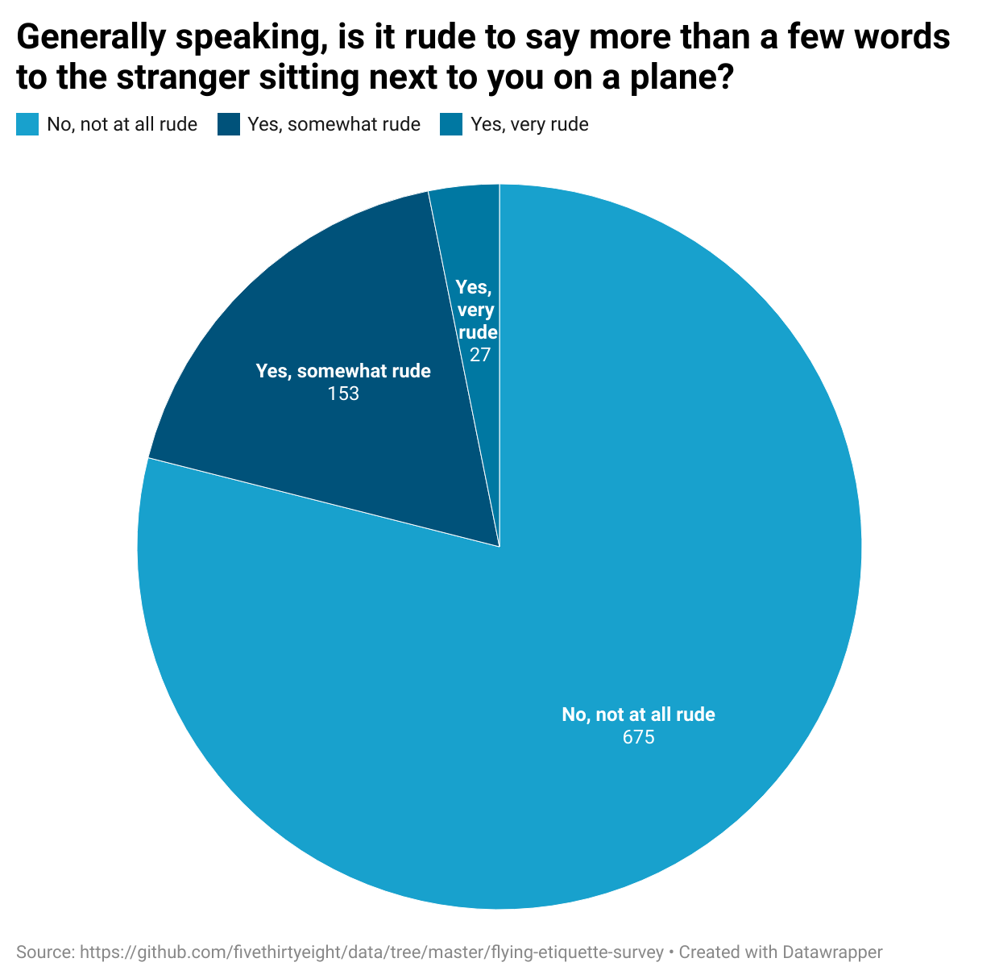

# J124 Week 4 HW
## Explanation 
I chose this question because many people have experienced talking to strangers on the plane, however, there are uncertainties about what is considered rude or polite in a shared spaces, like airplanes. I found it interesting that more people considered talking to strangers as rude or somewhat rude. My chart shows that more than half of the people surveyed thinks it is not rude to have more than few words to stranger sitting next to you. 

